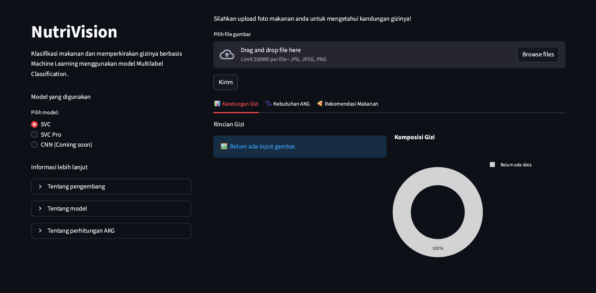

# Prediksi Makanan Berserta Estimasi Gizi Menggunakan Citra Makanan
(nama) adalah aplikasi web interaktif berbasis **Streamlit** yang dapat mengklasifikasikan makanan dari citra (gambar) dan memperkirakan kandungan gizinya secara otomatis.

Aplikasi ini menggunakan machine learning untuk mengenali jenis makanan dari foto yang diunggah. Berdasarkan hasil klasifikasi, sistem akan menghitung estimasi kandungan gizi (karbohidrat, protein, lemak, dan kalori) untuk setiap makanan.

Selain itu, aplikasi ini dilengkapi fitur untuk menghitung seberapa besar konsumsi makanan tersebut memenuhi Angka Kecukupan Gizi (AKG) harian, serta memberikan rekomendasi makanan tambahan untuk menyeimbangkan kebutuhan gizi pengguna.

> 🔍 Dibangun untuk menggabungkan machine learning, analisis citra digital, dan estimasi gizi dalam satu aplikasi web interaktif yang ringan.

## 🚀 Try the App
Coba aplikasi web-nya disini:

## ✨ Features
- 🧁 Food image classification using machine learning  
- 🍽️ Automatic nutrient estimation (carbohydrate, protein, fat, calories)  
- 📊 AKG fulfillment calculation  
- 🧩 Smart food recommendation to meet remaining nutritional needs  
- 🧠 Built with Streamlit, Python, and TensorFlow/ONNX

## 🎥 Demo Video

## 📸 Screenshots
- Landing page. 
- Saat input makanan, mengklasifikasikan makanan dan memberi estimasi kandungan gizinya.

- Perhitungan AKG harian yang diperlukan.

- Rekomendasi makanan yang bisa memenuhi AKG harian.

## 🛠️ Tech Stack
- **Frontend:** Streamlit, Plotly  
- **Machine Learning:** TensorFlow, ONNX Runtime, Scikit-learn  
- **Image Processing:** OpenCV, Scikit-image, Pillow, Rembg  
- **Data Processing:** Pandas, NumPy  
- **Utilities:** Joblib

## 👤 Authors
Project ini dikembangkan oleh:
- Muhammad Ariq Hibatullah
- Firdaini Azmi
- Reva Deshinta Isyana
