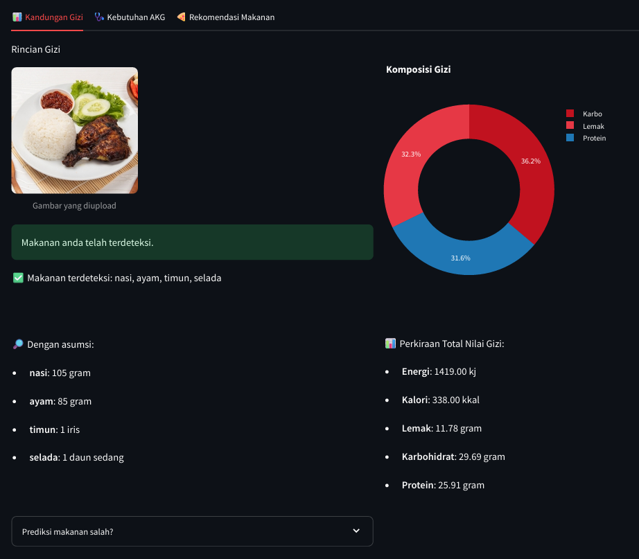
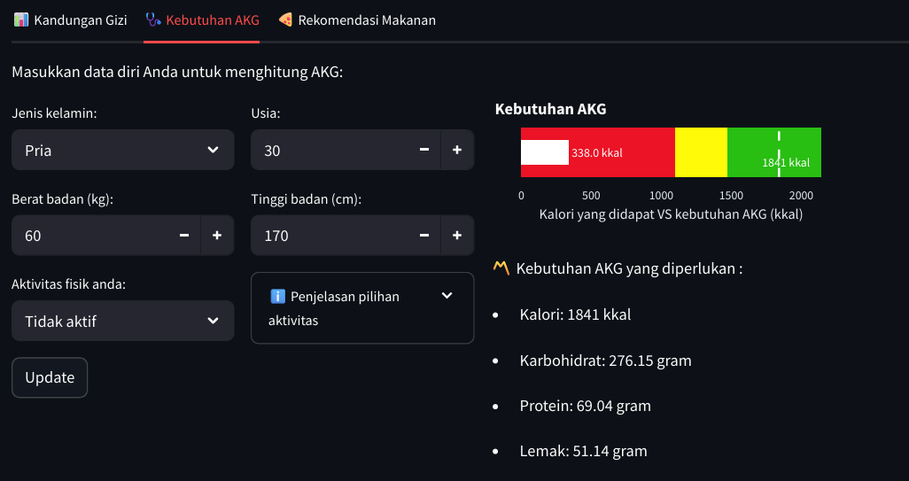
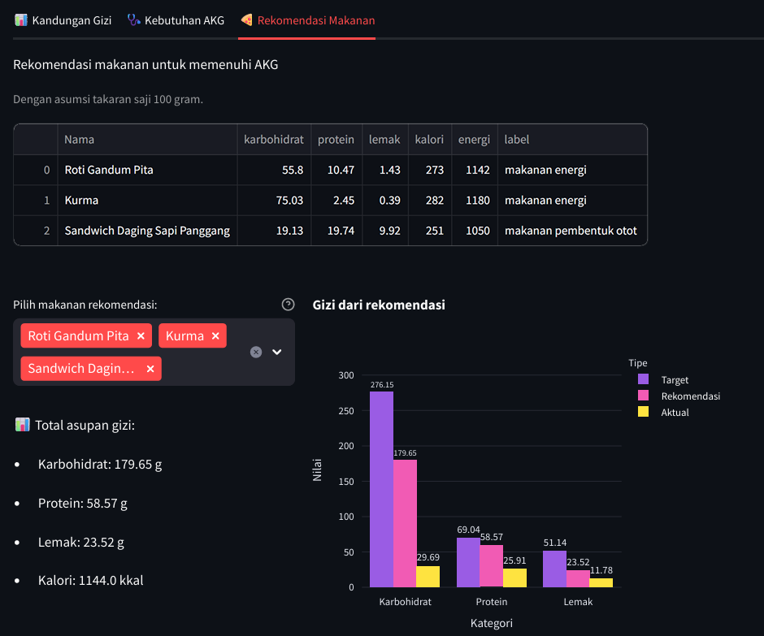

# 🍱 NutriVision - Food Nutrient Estimation & Recommendation App
**NutriVision** adalah aplikasi web interaktif berbasis **Streamlit** yang dapat mengklasifikasikan makanan dari citra (gambar) dan memperkirakan kandungan gizinya secara otomatis.

Aplikasi ini menggunakan machine learning untuk mengenali jenis makanan dari foto yang diunggah. Berdasarkan hasil klasifikasi, sistem akan menghitung estimasi kandungan gizi (karbohidrat, protein, lemak, dan kalori) untuk setiap makanan.

Selain itu, aplikasi ini dilengkapi fitur untuk menghitung seberapa besar konsumsi makanan tersebut memenuhi Angka Kecukupan Gizi (AKG) harian, serta memberikan rekomendasi makanan tambahan untuk menyeimbangkan kebutuhan gizi pengguna.

> 🔍 Dibangun untuk menggabungkan machine learning, analisis citra digital, dan estimasi gizi dalam satu aplikasi web interaktif yang ringan.

## 🚀 Try the App
Coba aplikasi web-nya disini:

## ✨ Features
- 🧁 Food image classification using machine learning  
- 🍽️ Automatic nutrient estimation (carbohydrate, protein, fat, calories)  
- 📊 AKG fulfillment calculation  
- 🧩 Smart food recommendation to meet remaining nutritional needs  
- 🧠 Built with Streamlit, Python, and TensorFlow/ONNX

## 🎥 Demo Video
Tonton video demonstrasinya disini:

## 📸 Screenshots
- Landing page.

- Klasifikasi makanan dan memberi estimasi kandungan gizinya.

- Perhitungan AKG harian yang diperlukan.

- Rekomendasi makanan yang bisa memenuhi AKG harian.

## 🛠️ Tech Stack
- **Frontend:** Streamlit, Plotly  
- **Machine Learning:** TensorFlow, ONNX Runtime, Scikit-learn  
- **Image Processing:** OpenCV, Scikit-image, Pillow, Rembg  
- **Data Processing:** Pandas, NumPy  
- **Utilities:** Joblib

## 📐 Nutrient Estimation Formula
Pada app ini untuk perhitungan AKG harian, kami menggunakan rumus Harris Benedict yang bersumber dari website mymealcatering. Website tersebut bisa diakses [disini](https://www.mymealcatering.com/kesehatan/cara-menghitung-akg-yang-benar.html).

## 👤 Authors
Project ini dikembangkan oleh:
- Muhammad Ariq Hibatullah - S1 Sains Data
- Firdaini Azmi - S1 Sains Data
- Reva Deshinta Isyana - S1 Sains Data

## 🆕 Update Log
### 🔸 v1.2 – Agustus 2025
- Menambahkan model SVC Pro ke dalam program
- Memperbarui UI Streamlit

### 🔸 v1.1 – Mei 2025
- Menambahkan model SVC ke dalam program
- Menambahkan fitur hitung AKG harian dan rekomendasi makanan
